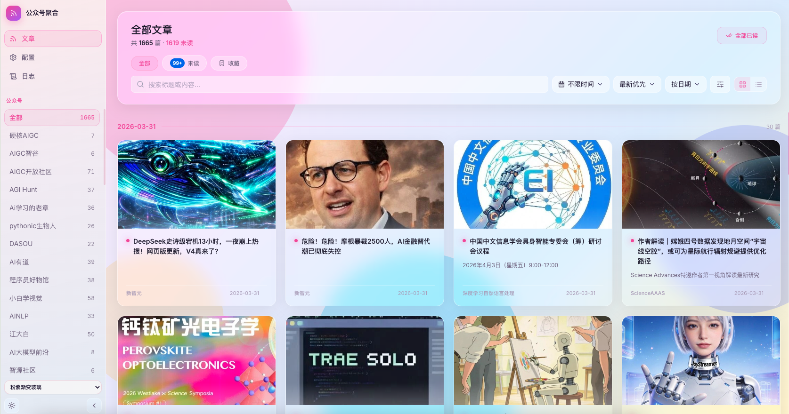

# pika-weixin-collection

微信公众号聚合平台——在保留原有公众号抓取与阅读能力的基础上，已接入统一内容池、多来源信源和内容闭环视图，可在本地 Web 界面中统一筛选、阅读、同步和回写反馈。



---

## 快速启动

### 1. 环境准备

```bash
# 推荐使用 uv 管理 Python 依赖
uv sync

# 前端依赖（首次或 package 变更后）
cd frontend && npm install && cd ..
```

### 2. 一键启动前后端（推荐）

在项目根目录执行：

```bash
./start_all.sh
```

脚本会并行启动：

- 后端 API：`http://127.0.0.1:8000`（`uv run uvicorn api:app --reload --port 8000`）
- 前端开发服：`http://127.0.0.1:5173`（`frontend` 内 `npm run dev`）

按 `Ctrl+C` 会结束前后端子进程。

### 3. 首次使用：微信凭证

1. 启动服务后打开 **http://127.0.0.1:5173**
2. 进入 **「配置」** 页
3. 点击 **「扫码登录」**，按提示用微信扫描公众平台登录页；成功后 **token / cookie 会自动写入** `data/id_info.json`

若凭证过期，配置页顶部会出现提示，同样通过 **扫码登录** 续期即可。

### 4. LLM 能力（可选）

#### 公众号新文章打标签与摘要

爬取到**新文章**时，若配置了 LLM 接口，会为每篇生成 `tags` 与 `summary` 并写入 `message_info.json`。

| 环境变量 | 说明 |
|----------|------|
| `QWEN35_27B_ENDPOINT` | 自部署或网关的 Chat Completions 兼容地址（POST JSON）。未设置则跳过公众号文章打标与摘要。 |
| `QWEN35_27B_API_KEY` 或 `LLM_API_KEY` | 可选；若设置则请求头携带 `Authorization: Bearer <密钥>`。 |
| `QWEN35_27B_MODEL` | 可选，默认 `Qwen3.5-27B`。 |

#### 内容池 AI 富化

统一内容池的 AI 分类与摘要使用独立配置：

| 环境变量 | 说明 |
|----------|------|
| `CONTENT_LOOP_LLM_BASE_URL` 或 `CONTENT_LOOP_LLM_ENDPOINT` | OpenAI-compatible `/chat/completions` 地址或其 base URL。 |
| `CONTENT_LOOP_LLM_API_KEY` | 内容池 AI 富化使用的 API key。 |
| `CONTENT_LOOP_LLM_MODEL` | 可选，默认 `moonshot-v1-8k`。 |
| `CONTENT_LOOP_LLM_TIMEOUT` | 可选，请求超时秒数。 |

### 5. 手动分启（备选）

```bash
# 终端 1
uv run uvicorn api:app --reload --port 8000

# 终端 2
cd frontend && npm run dev
# 浏览器访问 http://localhost:5173
```

---

## 功能说明

### 页面与能力

| 页面 / 模块 | 说明 |
|------------|------|
| **内容池** | 首页 `/`，直接读取统一内容池，按来源类型、来源名、标签、AI 分类、人工决策、日期和关键词统一筛选。 |
| **公众号 Feed** | `/feed` 保留原有公众号阅读视图，含导出、广告过滤、语义搜索、分组排序、已读/收藏。 |
| **信源** | `/sources` 展示统一信源读模型，聚合公众号注册表与外部源配置，可逐个触发同步。 |
| **闭环台** | `/loop` 提供同步公众号到内容池、同步外部源、批量打标签、AI 富化、人工反馈和新增视频/播客信源入口。 |
| **配置** | `/config` 提供公众号管理、扫码登录、立即爬取、定时爬取、缓存清理、封面补全。 |
| **统计** | `/stats` 展示最近 14 天发文趋势、总文章增长曲线，以及公众号近 7/30 天活跃度。 |
| **日志** | `/logs` 展示公众号操作、多来源同步、标签、AI 富化、导出等日志。 |

### 多来源内容池

- 首页内容池使用 `data/content_items.jsonl` 作为统一读模型
- 当前已接入：公众号文章、GitHub 仓库、B 站视频、播客 / RSS
- `/api/content-loop/sync-wechat` 将现有 `message_info.json` 标准化写入内容池
- `/api/content-loop/sync-external` 按 `data/external_sources.json` 或 example 配置同步外部源
- `/api/content-loop/feedback` 将人工判断写入 `data/feedback_events.jsonl`
- `/api/content-loop/tagging` 和 `/api/content-loop/ai-enrich` 为内容池补充标签、AI 摘要与分类

### 公众号数据链路

- 支持按公众号 `fakeid` 批量拉取近一个月文章
- 基于 `msgid-aid-create_time` 组合 ID 增量去重
- 用户删除的文章 id 记入 `deleted_article_ids.json`，后续爬取跳过
- 封面图落地 `data/covers/`，大图等比缩放；规避 CDN 防盗链
- 爬取前凭证预检，失效时中止并提示
- 重要操作写入 `data/operation_logs.jsonl`
- MinHash+LSH 相似文检测，并叠加本地轻量语义相似度补判

### 技术栈

**前端：** Vue 3 · TypeScript · Vite · Tailwind CSS v4 · Pinia（持久化）· Vue Router · lucide-vue-next  
**后端：** FastAPI · uvicorn · APScheduler · Pillow · requests · DrissionPage  
**数据：** 本地 JSON / JSONL（`data/`），无需数据库  

---

## 目录结构

```text
pika-weixin-collection/
├── start_all.sh
├── api.py
├── pyproject.toml
├── data/
│   ├── id_info.json
│   ├── name2fakeid.json
│   ├── message_info.json
│   ├── message_detail_text.json
│   ├── content_items.jsonl
│   ├── feedback_events.jsonl
│   ├── external_sources.example.json
│   ├── tag_taxonomy.example.json
│   ├── covers/
│   └── operation_logs.jsonl
├── src/
│   ├── content_loop/
│   │   ├── store.py
│   │   ├── external_sources.py
│   │   ├── media_sources.py
│   │   ├── source_configs.py
│   │   ├── tagging.py
│   │   └── ai_enrichment.py
│   ├── crawler/
│   ├── llm/
│   │   ├── model_client.py
│   │   ├── article_summary.py
│   │   └── article_tagging.py
│   ├── llm_wiki_bridge/
│   └── utils/
└── frontend/
    ├── src/
    │   ├── App.vue
    │   ├── router/index.ts
    │   ├── stores/
    │   │   ├── articles.ts
    │   │   ├── contentItems.ts
    │   │   ├── sources.ts
    │   │   └── config.ts
    │   └── views/
    │       ├── UnifiedContentView.vue
    │       ├── FeedView.vue
    │       ├── SourcesView.vue
    │       ├── ContentLoopView.vue
    │       ├── StatsView.vue
    │       ├── ConfigView.vue
    │       └── LogView.vue
    ├── public/
    └── scripts/copy-static-data.mjs
```

---

## 生产构建

```bash
cd frontend
npm run build
# 构建产物会自动把 data/*.json、data/*.jsonl 以及存在的 covers 复制到 dist/data/
```

### Docker Compose 一键部署

```bash
docker compose up --build
```

默认端口：
- 前端预览：`http://127.0.0.1:4173`
- 后端 API：`http://127.0.0.1:8000`

Compose 会把仓库根目录 `data/` 挂载到后端容器内，前端容器在构建时会将已有 `data/` 内容复制进 `dist/data/`。

---

## 当前进度

### 已完成

- [x] 统一内容池首页 `/`
- [x] 公众号兼容视图 `/feed`
- [x] 统一信源页 `/sources`
- [x] 内容闭环页 `/loop`
- [x] 内容池接口并入 `api.py`
- [x] 定时爬取、封面补全、导出、广告过滤、语义搜索、语义去重保留
- [x] PWA、静态构建、Docker Compose 保留

### 端到端验证结果

- [x] 运行一次 `/api/content-loop/sync-wechat`，确认本地 `content_items.jsonl` 创建或更新（当前结果：写入 230 条 `wechat_article`）
- [x] 同步一个外部信源，确认内容真正进入内容池（当前结果：example 中 `horizon` GitHub 信源写入 6 条 `github_repo`）
- [x] 页面级路由走查已完成首轮验证：`/#/`、`/#/feed`、`/#/sources`、`/#/loop`、`/#/stats`、`/#/config`、`/#/logs` 均通过浏览器级验证；其中 `/#/feed` 已额外确认“展开筛选”可点击，且高级筛选面板中的广告过滤与语义搜索控件可见
---

## MinHash 实验记录

在 4005 条博文的测试集下的去重实验（`minhash_0.9` 代表 MinHashLSH 阈值为 0.9）：

| 方法 | 检测重复个数 | 错误个数 |
|------|------------|---------|
| minhash_0.9 | 528 | 0 |
| minhash_0.8 | 699 | 24 |
| minhash_0.8 + 规则 0.7 | 665 | 1（文字很少，主体为图片） |

---

## 类似项目参考

- [wechat-article-exporter](https://github.com/jooooock/wechat-article-exporter)
- [WeChat_Article](https://github.com/1061700625/WeChat_Article)
