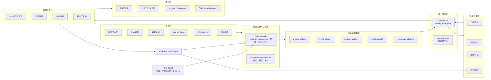

# 多源信息中枢架构设计

## 1. 产品定位

项目不再定位为“微信公众号聚合平台”，而是一个本地优先的 **个人多源信息摄取与内容生产中枢**。

它服务的不是“把公众号文章列出来”这个单点需求，而是：

- 把公众号、B 站、播客、GitHub、RSS、手动收藏等来源统一纳入一个内容池。
- 用 AI 完成转写、摘要、分类、标签、去重、聚合和初稿生成。
- 让用户用阅读、收藏、采纳、改写、删除、深挖等动作反向调优系统。
- 最终产出日报、选题、公众号草稿、知识库材料、Markdown/HTML/飞书等可复用内容。

一句话：

> 人决定信源、主题、判断和输出目标；系统负责把多源信息变成可筛选、可追溯、可生成的内容资产。

## 2. 核心用户体验

目标体验不是“打开后看到公众号列表”，而是“打开后看到今天所有来源里值得处理的内容”。

主路径：

```text
添加信源
  -> 同步/转写
  -> 进入统一内容池
  -> AI 摘要、标签、评分
  -> 用户阅读、筛选、反馈
  -> 生成日报/选题/草稿/知识库
  -> 输出后的反馈继续回写
```

首页应该是“统一内容池”，默认按价值和时间混合排序。公众号只是 `source_type=wechat_article` 的一个筛选条件，不再是产品身份。

## 3. 设计原则

- 信源独立：公众号、B 站、播客、GitHub 不互相伪装，每类来源保留自己的采集方式。
- 内容统一：所有来源最终都转成 `ContentItem`，前端阅读、筛选、AI 处理、输出都只依赖统一内容池。
- 人是控制面：信息源、主题、输出目标、采纳与否由用户决定，AI 做放大和候选生成。
- 可追溯：每个摘要、草稿、报告都能追到原始 URL、source id、抓取时间和原文快照。
- 本地优先：默认写入 `data/`，真实密钥、运行缓存、音视频缓存不进入 Git。
- 云端模型可插拔：视频/播客 ASR 走小米 Omni 等云端能力，不默认本地跑模型。
- 渐进迁移：保留现有公众号爬虫和数据文件，用统一内容池逐步接管前端主体验。

## 4. 当前系统与目标系统

### 当前已经具备

- 公众号采集：`name2fakeid.json`、`message_info.json`、`message_detail_text.json`。
- 外部信源：`data/external_sources.json` 支持 `github_repo`、`bilibili_video`、`podcast_feed`。
- 统一内容池：`data/content_items.jsonl`。
- 内容处理：主题标签、AI 分类总结、反馈事件。
- 现有 API：`/api/content-loop/*` 已覆盖同步、来源新增、打标、AI enrichment、反馈。
- 前端闭环页：`ContentLoopView.vue` 已能展示外部信源、内容池和操作入口。

### 当前主要断点

- 首页仍由 `frontend/src/stores/articles.ts` 读取 `/data/message_info.json`，只展示公众号文章。
- 筛选逻辑仍以公众号为中心，`source_type`、`source_id`、转写状态、AI 状态不是一等筛选条件。
- 侧边栏和 README 仍强化“公众号聚合”的产品身份。
- 信源管理分散：公众号在配置页，B 站/播客在内容闭环页，GitHub 主要依赖 JSON。
- 视频/播客转写是长任务，但目前缺少统一任务队列、进度、重试、取消和失败诊断。
- 输出层还弱，尚未形成日报、选题、草稿、知识库发布的稳定工作台。

## 5. 总体架构



## 6. 分层设计

### 6.1 信源注册层

信源注册层负责“系统应该关注什么”，不负责具体抓取。

当前短期继续使用：

- `data/name2fakeid.json`：公众号专用注册表。
- `data/external_sources.json`：GitHub、B 站、播客等外部信源注册表。

目标中期收敛为统一 `SourceConfig` 读模型：

```text
SourceConfig
  id
  type                  # wechat_account | bilibili_video | podcast_feed | github_repo | rss_feed | manual_clip
  name
  url
  enabled
  sync_policy           # manual | hourly | daily | weekly
  human_reason
  options
  created_at
  updated_at
  last_synced_at
  last_error
```

迁移策略：

- 不强行废掉 `name2fakeid.json`，先在后端聚合成统一 Source 列表给前端。
- 外部来源继续走 `external_sources.json`，新增字段时保持向后兼容。
- 前端信源管理页展示统一 Source，但保存时仍写回各自原文件。

### 6.2 采集适配器层

每个适配器只做三件事：

1. 读取对应 `SourceConfig`。
2. 抓取或下载原始内容。
3. 输出标准 `FetchedItem`，不直接决定前端展示。

标准输出：

```text
FetchedItem
  id
  source_id
  source_type
  source_name
  title
  url
  author
  published_at
  fetched_at
  digest
  content_markdown
  media
  metadata
  references
```

适配器边界：

- 微信公众号：保留现有爬虫，继续写 `message_info.json`，再同步为 `wechat_article` ContentItem。
- B 站：优先官方字幕；没有字幕时下载音频并调用云端 ASR。
- 播客：优先 RSS shownotes；需要全文时下载 episode 音频并调用云端 ASR。
- GitHub：通过 GitHub API 抓 README、docs、releases，不把 repo 当静态文件导入。
- RSS/手动收藏：后续新增时只需实现适配器，不改内容池和前端主逻辑。

### 6.3 任务层

视频、播客、GitHub docs 同步都可能耗时，不能长期依赖一次 HTTP 请求完成。

目标任务模型：

```text
Job
  id
  type                  # sync_source | transcribe_media | ai_enrich | export
  source_id
  item_id
  status                # queued | running | succeeded | failed | cancelled
  progress
  message
  error
  created_at
  started_at
  finished_at
  retry_count
```

短期实现可以先用 JSONL：

- `data/job_runs.jsonl`
- `data/job_events.jsonl`

前端需要一个任务视图：

- 当前正在同步什么。
- 转写到了哪一步。
- 失败原因是什么。
- 是否可以重试。

### 6.4 统一内容池

`ContentItem` 是前端和智能处理层唯一应该依赖的内容读模型。

现有字段继续保留：

```text
ContentItem
  id
  source_type
  source_id
  source_name
  title
  url
  author
  published_at
  fetched_at
  summary
  ai_summary
  tags
  auto_tags
  ai_tags
  ai_category
  ai_confidence
  score
  status
  human_decision
  feedback_notes
  content_preview
  content_markdown
  content_hash
  dedupe_key
  references
  metadata
```

关键规则：

- `message_info.json` 是微信公众号原始缓存，不是未来前端主数据源。
- `raw/sources/**` 是知识库导出或调试快照，不是信源注册表。
- `content_items.jsonl` 是当前最小可行内容池；数据量变大后再迁移 SQLite。

### 6.5 智能处理层

智能处理层负责把“采集到的信息”变成“可决策的素材”。

已有能力：

- 本地主题词表打标签。
- AI 摘要、AI 标签、AI 分类。
- 人工反馈写回。

目标能力：

- 去重：跨公众号/B 站/播客/GitHub 识别同一主题或重复引用。
- 排序：结合发布时间、来源权重、反馈、AI 置信度、用户关注主题。
- 搜索：支持标题、摘要、全文、转写文本、source、tag、decision。
- 聚合：围绕一个主题把多条 ContentItem 合成日报或选题包。
- 反馈学习：根据 adopted/rejected/dig_deeper 调整来源权重和推荐阈值。

### 6.6 前端工作台

目标导航：

```text
内容池
信源
任务
输出
设置
日志
```

页面职责：

- 内容池：首页，展示所有 `ContentItem`，支持来源类型、来源名称、标签、AI 状态、人工决策、时间范围筛选。
- 信源：统一管理公众号、B 站、播客、GitHub、RSS、手动收藏，支持新增、停用、同步、删除。
- 任务：查看同步、转写、AI enrichment、导出的状态和错误。
- 输出：从筛选结果生成日报、选题、草稿、Markdown、llm_wiki source。
- 设置：凭证、模型、ASR、缓存策略。
- 日志：系统操作和错误审计。

公众号旧文章流可以保留，但应降级为内容池中的一个视图：

```text
内容池?source_type=wechat_article
```

### 6.7 输出层

输出层是这个项目从“收集工具”升级为“生产工具”的关键。

优先级：

1. 本地日报：从今日新增内容生成一份 Markdown。
2. 主题选题包：围绕用户输入主题聚合来源、摘要和可写角度。
3. 公众号草稿：生成标题、结构、正文、引用来源和风险提示。
4. 知识库导出：把内容池导出为 llm_wiki raw sources。
5. 飞书/Slack/Webhook：把日报推到外部工作流。

输出必须保留来源引用，不默认自动发布。

## 7. API 设计

短期继续复用现有 `/api/content-loop/*`，同时按目标形态整理新接口边界。

### 7.1 信源

```text
GET    /api/sources
POST   /api/sources
PATCH  /api/sources/{source_id}
DELETE /api/sources/{source_id}
POST   /api/sources/{source_id}/sync
```

兼容映射：

- `GET /api/content-loop/sources`
- `POST /api/content-loop/sources`
- `POST /api/content-loop/sync-external`
- `POST /api/content-loop/sync-wechat`

### 7.2 内容池

```text
GET  /api/content/items
GET  /api/content/items/{item_id}
POST /api/content/items/{item_id}/feedback
POST /api/content/items/tagging
POST /api/content/items/ai-enrich
```

兼容映射：

- `GET /api/content-loop/items`
- `POST /api/content-loop/feedback`
- `POST /api/content-loop/tagging`
- `POST /api/content-loop/ai-enrich`

### 7.3 任务

```text
GET  /api/jobs
GET  /api/jobs/{job_id}
POST /api/jobs/{job_id}/retry
POST /api/jobs/{job_id}/cancel
```

### 7.4 输出

```text
POST /api/outputs/daily-brief
POST /api/outputs/topic-pack
POST /api/outputs/draft
POST /api/outputs/export/markdown
POST /api/outputs/export/llm-wiki
```

## 8. 数据文件规划

当前保留：

```text
data/name2fakeid.json
data/message_info.json
data/message_detail_text.json
data/external_sources.json
data/content_items.jsonl
data/topic_tags.jsonl
data/feedback_events.jsonl
data/operation_logs.jsonl
data/llm_wiki/**
```

建议新增：

```text
data/job_runs.jsonl
data/job_events.jsonl
data/output_artifacts.jsonl
data/source_scores.json
```

后续数据量扩大后再引入 SQLite：

```text
sources
source_runs
content_items
content_references
feedback_events
jobs
output_artifacts
```

迁移原则：

- 先稳定文件协议，再迁移数据库。
- 前端只通过 API 读写，不直接耦合具体存储。
- 每个 JSONL 行都是独立事件或独立 item，便于恢复和调试。

## 9. 前端迁移方案

### P0：统一内容池成为首页

- 新建 `useContentItemsStore`，从 `/api/content-loop/items` 读取数据。
- 新建或改造首页为 `UnifiedContentView`。
- 筛选条件改为：关键词、来源类型、来源名称、标签、AI 分类、人工决策、日期。
- 侧边栏品牌从“公众号聚合”改为“信息中枢”或“内容中枢”。
- 公众号文章流保留为 `source_type=wechat_article` 的筛选视图。

验收标准：

- B 站、播客、GitHub、公众号出现在同一个列表。
- 点击来源类型可过滤。
- 没有外部信源时，公众号内容仍能正常显示。

### P1：统一信源管理

- 新建“信源”页面，聚合公众号和外部信源。
- 支持新增 B 站/播客/GitHub/RSS/手动链接。
- 每个信源展示：类型、启用状态、最近同步时间、最近错误、内容数量。
- 支持单个信源立即同步。

验收标准：

- 不需要编辑 JSON 也能新增 B 站/播客。
- GitHub 源不再被误解为静态导入。
- 公众号配置仍可扫码和爬取。

### P2：任务与进度

- 同步、转写、AI enrichment 改成可观察任务。
- 前端展示任务进度、错误、重试。
- 操作日志与任务事件区分：日志用于审计，任务用于实时状态。

验收标准：

- B 站转写失败时用户能看到失败原因。
- 重试单个 source 不会重跑全部来源。

### P3：输出工作台

- 支持从当前筛选结果生成日报。
- 支持按主题生成选题包。
- 支持生成公众号草稿。
- 输出记录写入 `output_artifacts.jsonl`，并保留来源引用。

验收标准：

- 输出能追溯到具体 ContentItem。
- 用户能对草稿给出 adopted/rewrite/rejected 反馈。

## 10. 后端迁移方案

### P0：读模型收敛

- 保持公众号爬虫不动。
- 确保 `sync_wechat_content_items()` 稳定把公众号缓存转为 `ContentItem`。
- 首页数据只从内容池 API 读取。

### P1：Source 服务

- 抽出 `src/content_loop/sources.py` 聚合 `name2fakeid.json` 和 `external_sources.json`。
- 给前端提供统一 `Source` 响应。
- 新增 source 更新、停用、删除的后端函数。

### P2：Job 服务

- 抽出 `src/content_loop/jobs.py`。
- 长任务写 `job_runs.jsonl` 和 `job_events.jsonl`。
- API 返回 `job_id`，前端轮询 job 状态。

### P3：Output 服务

- 抽出 `src/content_loop/outputs.py`。
- 从 ContentItem 查询结果生成日报、主题包、草稿。
- 输出路径统一写入 `data/outputs/`，元数据写入 `output_artifacts.jsonl`。

## 11. AI 与 ASR 边界

### LLM

用途：

- 内容摘要。
- 标签/分类。
- 主题聚合。
- 日报和草稿生成。
- 根据反馈给出来源和模板调整建议。

配置：

```text
CONTENT_LOOP_LLM_BASE_URL
CONTENT_LOOP_LLM_API_KEY
CONTENT_LOOP_LLM_MODEL
CONTENT_LOOP_LLM_TIMEOUT
```

### ASR

用途：

- B 站无字幕视频转写。
- 播客音频转写。

配置：

```text
WECHATOA_ASR_PROVIDER=xiaomi_omni
WECHATOA_ASR_MODEL=mimo-v2-omni
CONTENT_LOOP_LLM_BASE_URL=https://token-plan-sgp.xiaomimimo.com/v1
CONTENT_LOOP_LLM_API_KEY=...
```

边界：

- 不默认本地跑 ASR 模型。
- 不把音视频缓存提交到 Git。
- 长音频必须进入任务层，避免阻塞普通 HTTP 请求。

## 12. 风险与约束

- 微信凭证会过期，公众号采集必须保留凭证检测和扫码续期。
- GitHub API 可能触发 rate limit，需要支持 token 和错误展示。
- B 站/播客转写成本和耗时较高，需要 source 级别开关和任务重试。
- JSONL 简单可靠，但全文搜索和多条件查询会逐渐变慢，后续需要 SQLite/FTS。
- AI 输出不能直接发布，必须先进入草稿和人工审核。
- 真实 API key、cookie、音视频缓存、生成结果大文件都不能进入 Git。

## 13. 非目标

- 不把所有信息源都塞进 `name2fakeid.json`。
- 不用 iframe 假装实现前端。
- 不把 llm_wiki raw snapshot 当作主信源注册表。
- 不默认全自动发布到外部平台。
- 不为了多源而重写现有公众号爬虫。

## 14. 最小落地路线

第一步只做一件事：让统一内容池成为用户看到的第一屏。

```text
frontend/src/stores/articles.ts
  当前：读取 message_info.json
  目标：保留为公众号兼容 store

新增 useContentItemsStore
  读取 /api/content-loop/items

FeedView / 新 UnifiedContentView
  展示 ContentItem
  支持 source_type/source_id/tag/decision 筛选

AppSidebar
  品牌改为内容中枢
  公众号列表改为信源列表或来源筛选
```

完成这一步后，B 站、播客、GitHub 才会从“闭环页里的附属能力”变成产品主体验的一部分。
